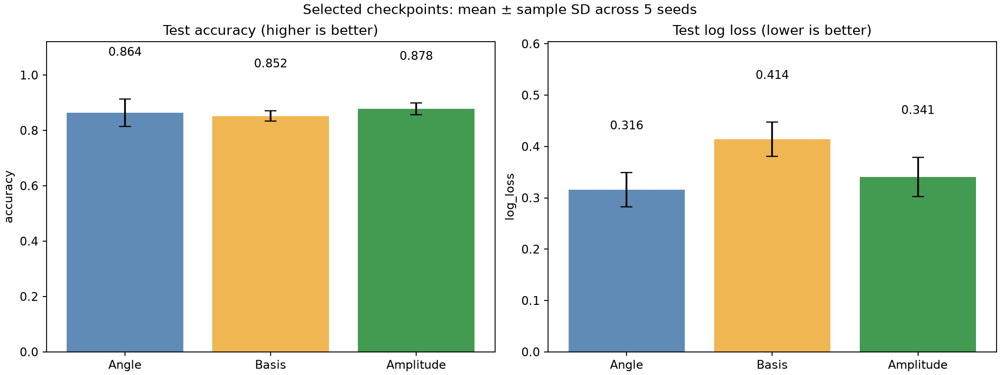
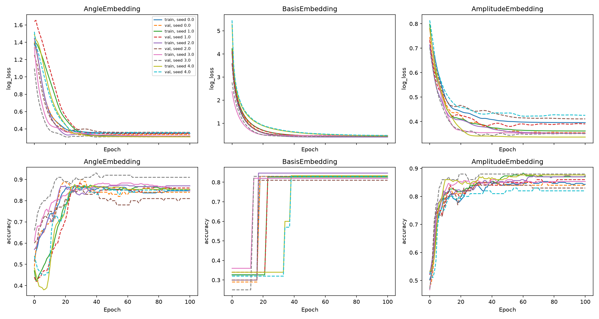
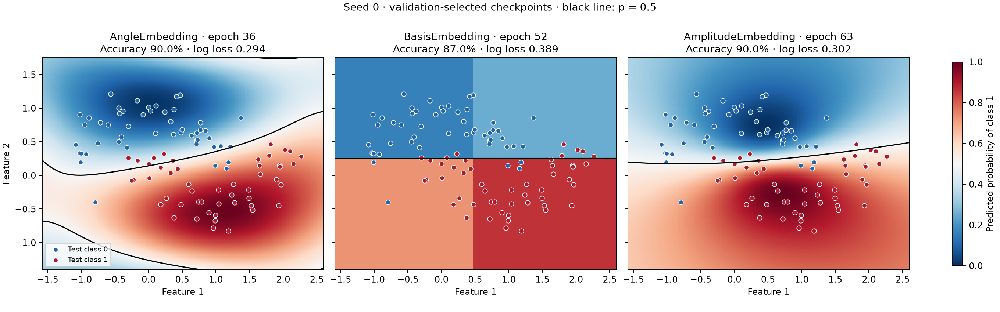
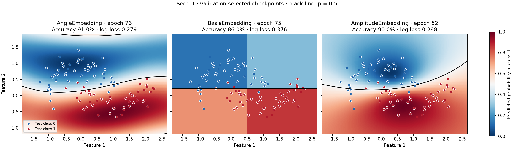
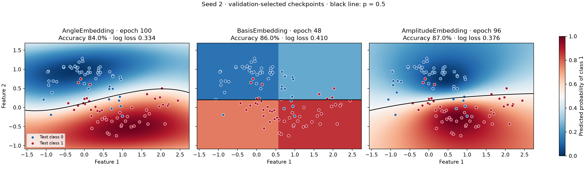
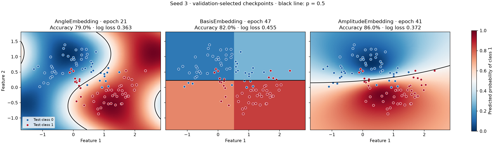
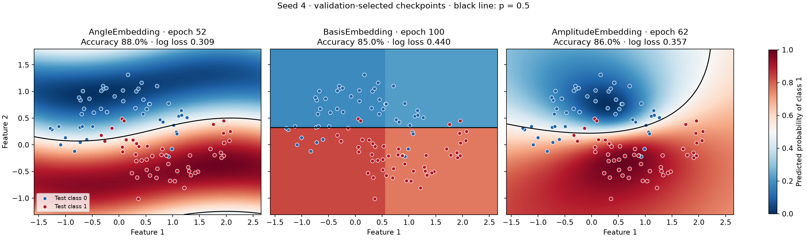

# Quantum input encoding comparison

[Repository overview and setup](README.md) · [Classical and quantum model comparison](COMPARISON.md)

[compare_encodings.py](compare_encodings.py) trains and tests three PennyLane classifiers on the same two-moons data used by [compare.py](compare.py). Both scripts live at the repository root because the encoding experiment imports shared splitting, metrics, CSV, summary, and plotting utilities from `compare.py`. Its outputs are saved separately in [encoding_results/](encoding_results/).

## Run

Use the shared environment described in the [README](README.md#setup), with dependencies from [requirements-compare.txt](requirements-compare.txt). Run commands from the repository root with that environment activated.

```bash
python compare_encodings.py
# Quick integration check:
python compare_encodings.py --samples 50 --seeds 0 1 --epochs 3 --output /tmp/encoding-smoke
```

Options: `--samples`, `--noise`, `--seeds`, `--epochs`, `--layers`, `--learning-rate`, `--output`, and `--plots-only` (regenerate figures from saved results). Defaults are 500 samples, noise 0.2, seeds 0–4, 100 Adam steps, three trainable layers, and learning rate 0.05. Results go to `encoding_results/`. Reusing an output directory overwrites matching files.

## Encoding choices

StandardScaler is fitted only on training data. For each standardized coordinate pair `(x1, x2)`:

| Template | Input preparation |
| --- | --- |
| AngleEmbedding | Use `(x1, x2)` as Y rotation angles in radians. |
| BasisEmbedding | Threshold each coordinate at its training-set median, producing two bits. |
| AmplitudeEmbedding | Normalize `[x1, x2, 1, 0]` to unit L2 norm. |

Basis encoding reduces continuous inputs to four possible states, so examples with the same bits necessarily receive the same probability. Its results measure both this information loss and circuit training. More bits per feature would be a separate investigation requiring more qubits.

The amplitude reference value `1` prevents zero-norm inputs and preserves feature magnitude relative to that reference. Simply zero-padding and normalizing `[x1, x2]` would discard radius and map opposite vectors to physically equivalent states. The reference component is an explicit modeling choice.

Official template documentation: [AngleEmbedding](https://docs.pennylane.ai/en/stable/code/api/pennylane.AngleEmbedding.html), [BasisEmbedding](https://docs.pennylane.ai/en/stable/code/api/pennylane.BasisEmbedding.html), and [AmplitudeEmbedding](https://docs.pennylane.ai/en/stable/code/api/pennylane.AmplitudeEmbedding.html).

## Training protocol

- Stratified 60% training, 20% validation, 20% held-out test splits; identical splits for all encodings within each seed.
- Two qubits on `default.qubit`, exact expectations (`shots=None`).
- One embedding at the start, followed by the same trainable layers: one `Rot` per qubit and a CNOT from wire 0 to wire 1. There are `6 * layers` trainable parameters.
- Identical initial weights per seed across encodings, full-batch Adam, binary cross entropy, and probability `(1 + <Z0>) / 2`.
- Only circuit weights are differentiated. Inputs and preprocessing are fixed.
- Select the checkpoint with lowest validation log loss, including initialization at epoch 0. Test labels are used only for final evaluation.

The original `compare.py` re-uploads angle inputs in every block. This experiment embeds once for all three models, so its angle results are not directly equivalent to that original circuit. Different initial encoded states can also produce different initial losses despite identical weights.

Basis states are evaluated once per each of the four possible bit patterns, then probabilities are gathered for all examples. This is mathematically equivalent to evaluating each example independently, but runtime comparisons reflect this optimization. Fit timing includes training and validation metrics and excludes preprocessing. Simulator timings do not measure hardware state-preparation costs.

## Outputs

Default folder: [encoding_results/](encoding_results/), next to the script. The model comparison writes to the separate `comparison_results/` folder. Classification metric definitions are shared with [COMPARISON.md](COMPARISON.md#exact-metrics); encoding fit timings include training and validation evaluation as described above.

- `metrics.csv`: train, validation, and test metrics at the selected checkpoint, fit time, and selected epoch.
- `summary.csv`: test metric means and sample standard deviations across seeds; SD is blank with one seed.
- `training_history.csv`: train/validation loss and accuracy at every epoch, plus cumulative elapsed time.
- `learning_curves.png`: loss and accuracy curves for each encoding.
- `test_comparison.png`: mean test accuracy and log loss with sample standard deviation bars.
- `decision_boundaries_seed_*.png`: classification diagrams for all three encodings at each seed’s selected checkpoints.
- `config.json`: settings, preprocessing rules, and package versions.
- `data_seed_*.npz`: original data, split indices, scaling statistics, basis thresholds, and initial weights.
- `<Encoding>_seed_*.npz`: selected circuit weights, selected epoch, and encoded inputs in original sample order.

Compare convergence using training/validation curves, generalization using held-out test metrics, and variation across seeds. A short smoke run verifies execution; use the full training budget to investigate performance. Results apply to these preprocessing rules and this fixed circuit, rather than establishing an encoding ranking across tasks.

## Results

These saved results use 500 samples per seed, noise 0.2, seeds 0–4, 100 training steps, three trainable layers, and learning rate 0.05. Each run has 300 training, 100 validation, and 100 test samples. Final classifiers use the checkpoint with the lowest validation log loss, which can occur before the last epoch.

### Summary

Across five seeds, the encoding changed both classification accuracy and the quality of predicted probabilities under the same circuit and training budget:

- **AmplitudeEmbedding achieved the highest mean test accuracy: 87.8%.** Its mean log loss was 0.341, and its accuracy varied by 2.0 percentage points across seeds (sample standard deviation).
- **AngleEmbedding achieved the lowest mean test log loss: 0.316**, with 86.4% accuracy. Its predicted probabilities scored best under log loss, although its accuracy varied more across seeds (4.9 percentage points).
- **BasisEmbedding achieved 85.2% accuracy and 0.414 log loss.** Thresholding the two features reduces inputs to four states, limiting the classifier to four constant-probability regions and discarding differences between points within each region.

There is no single winner on both metrics: amplitude encoding leads on accuracy, while angle encoding leads on log loss. These results compare the complete encoding and preprocessing choices on this two-moons task. Five seeds and one fixed circuit are insufficient to establish a general advantage or a statistically reliable ranking.

### Test accuracy and log loss

Values below are the mean ± sample standard deviation across five seeds. Higher accuracy and lower log loss are better. Error bars describe variation across runs; they are not confidence intervals.

| Encoding | Test accuracy | Test log loss |
| --- | ---: | ---: |
| AngleEmbedding | 86.4% ± 4.9 percentage points | 0.316 ± 0.033 |
| BasisEmbedding | 85.2% ± 1.9 percentage points | 0.414 ± 0.033 |
| AmplitudeEmbedding | 87.8% ± 2.0 percentage points | 0.341 ± 0.038 |



Amplitude encoding has the highest mean test accuracy in these runs; angle encoding has the lowest mean test log loss. These metrics measure different behavior: accuracy counts correct class decisions at the 0.5 threshold, while log loss measures the probabilities assigned to the true labels. Five seeds and this fixed setup do not establish a general ranking of encodings.

Source data: [summary.csv](encoding_results/summary.csv), [per-run metrics](encoding_results/metrics.csv), and [run configuration](encoding_results/config.json).

### Learning curves

Solid lines show training metrics and dashed lines show validation metrics for each seed. The upper row shows log loss; the lower row shows accuracy. Curves include initialization at epoch 0 and all 100 training steps, while final test metrics use the selected checkpoints.



### Final classification diagrams

Each row compares the three encodings for the same seed. Background color shows predicted class-1 probability, the black line marks the 0.5 decision threshold, and dots show held-out test samples colored by their true class. Axes use original feature coordinates. Panel titles give the selected epoch, test accuracy, and test log loss.

Basis encoding assigns the same prediction to all inputs within each of its four threshold regions, which explains its rectangular regions. Every seed is shown below so the visualization does not depend on choosing a favorable run.

#### Seed 0



#### Seed 1



#### Seed 2



#### Seed 3



#### Seed 4



### Reproduce the figures

A normal run now generates all figures automatically:

```bash
python compare_encodings.py
```

To regenerate figures from existing checkpoints and CSV files:

```bash
python compare_encodings.py --plots-only --output encoding_results
```

The results table above describes the saved run documented here. If you rerun with different settings, update the table from the new `summary.csv`.
