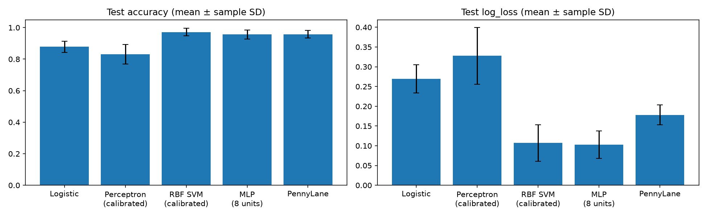
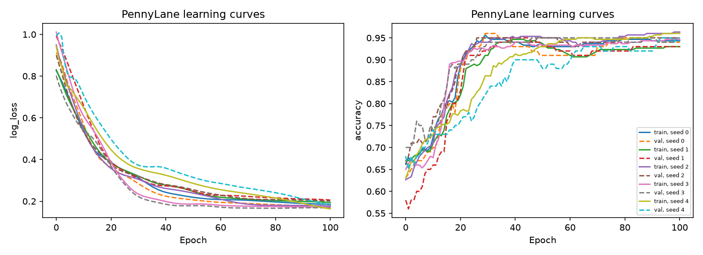
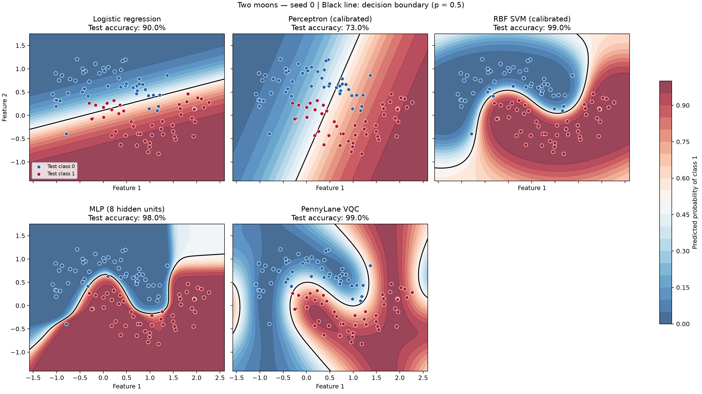

# Two-moons classification: linear, nonlinear, and quantum models

## Overview

This project compares five binary classifiers on the same noisy two-moons datasets:

- **Logistic regression:** a linear classifier that predicts class probabilities.
- **Calibrated perceptron:** a linear perceptron whose scores are converted into probabilities using a separate validation set.
- **Calibrated RBF SVM:** a nonlinear kernel classifier with validation-set probability calibration.
- **Small MLP:** a neural network with one hidden layer of eight tanh units.
- **PennyLane variational quantum classifier (VQC):** a trainable two-qubit circuit running on a classical simulator.

[compare.py](compare.py) runs the benchmark, records classification quality and timing, and saves plots. All models share the same data partitions and preprocessing for each seed. See [COMPARISON.md](COMPARISON.md) for detailed metric definitions and methodology.

## Development environment

The saved benchmark records the following environment in [config.json](comparison_results/config.json):

| Component | Recorded version |
|---|---|
| OS | Linux under WSL2, x86_64 |
| Kernel | 5.15.167.4-microsoft-standard-WSL2 |
| Python | 3.14.6 |
| NumPy | 2.5.3 |
| scikit-learn | 1.9.1 |
| PennyLane | 0.45.1 |
| Matplotlib | 3.11.2 |

Dependencies are pinned in [requirements-compare.txt](requirements-compare.txt). The quantum model uses PennyLane's `default.qubit` simulator with exact expectation values (`shots=None`). No quantum hardware is required. Matplotlib uses the `Agg` backend to save figures without a graphical display.

## Setup, running, and testing

### Setup

From the project directory, create and activate a virtual environment using the Python version above to match the recorded environment:

```bash
python3 -m venv .venv
source .venv/bin/activate
python -m pip install -r requirements-compare.txt
```

If `.venv` already exists, activate it and install the requirements.

### Run the comparison

```bash
python compare.py
```

The default run uses 500 examples for each of five seeds and trains the VQC for 100 steps and the MLP for 1,000 epochs. Results are written to `comparison_results/` next to the script. Existing files with matching names are overwritten.

To reproduce the saved settings in a separate directory:

```bash
python compare.py \
  --samples 500 --noise 0.2 --seeds 0 1 2 3 4 \
  --epochs 100 --layers 3 --learning-rate 0.05 \
  --output comparison_results_reproduced
```

Run `python compare.py --help` for all options. `--epochs`, `--layers`, and `--learning-rate` control the quantum model. The MLP uses `--mlp-epochs` (default 1000) and `--mlp-learning-rate` (default 0.01). Other classical model settings are fixed in their fitting functions.

### Smoke test

Run a small benchmark to check that data preparation, all five classifiers, CSV export, and plotting work together:

```bash
python compare.py --samples 100 --epochs 3 --mlp-epochs 3 --seeds 0 --output /tmp/moons-smoke
```

Expected output includes five console lines with test metrics and a final output-directory message. The directory should contain:

- `metrics.csv`: 15 data rows, covering five models and three splits.
- `quantum_history.csv`: 4 data rows, covering initialization and three training steps.
- `summary.csv`, `config.json`, and `data_seed_0.npz`.
- `comparison.png`, `quantum_learning_curves.png`, and `decision_boundaries_seed_0.png`.

This is an integration smoke test, not an accuracy acceptance test. Three training steps are insufficient to reproduce the full benchmark's quantum results. During the `main()` refactor, runs using 50 samples, seeds 0 and 1, and one quantum step produced identical metrics, saved data, and plots before and after the change; runtime measurements were excluded from that comparison.

## File architecture

```text
two-moons-classification/
├── README.md                      # Setup, workflow, and recorded results
├── COMPARISON.md                  # Detailed methodology and metric definitions
├── requirements-compare.txt       # Pinned benchmark dependencies
├── compare.py                     # Benchmark entry point and helper functions
└── comparison_results/
    ├── config.json               # Run settings, Python/platform, package versions
    ├── data_seed_<seed>.npz       # Original data, split indices, scaler statistics
    ├── metrics.csv               # Per-seed, per-model, per-split metrics
    ├── summary.csv               # Test means and sample standard deviations
    ├── quantum_history.csv       # Quantum training and validation curves
    ├── decision_boundaries_seed_<seed>.png # Five fitted classification boundaries
    ├── comparison.png            # Test accuracy and log loss comparison
    └── quantum_learning_curves.png
```

This tree shows the comparison's code, documentation, and saved benchmark outputs.

Within `compare.py`, responsibilities are divided as follows:

| Function | Responsibility |
|---|---|
| `parse_args()` | Read and validate command-line settings |
| `split_data()` | Create reproducible, stratified train/validation/test indices |
| `fit_logistic_regression()` | Fit logistic regression and return a probability predictor |
| `fit_perceptron()` | Fit and calibrate the perceptron; return its probability predictor and raw model |
| `fit_rbf_svm()` | Fit and calibrate the RBF SVM |
| `fit_mlp()` | Train the small MLP and select its validation checkpoint |
| `fit_quantum()` | Train the circuit and return the selected predictor, epoch, and history |
| `metrics()` | Calculate classification and probability metrics |
| `run_seed()` | Generate and scale data, fit models, and evaluate one seed |
| `summarize_results()` | Aggregate test results across seeds |
| `write_csv()` / `save_results()` | Save metrics, history, summaries, and configuration |
| `plot_comparison()` / `plot_learning_curves()` | Save the figures |
| `main()` | Coordinate these steps |

## Dataset

The dataset is generated locally with scikit-learn's `make_moons`; no download is needed. Each example has two numerical coordinates and a binary label, `0` or `1`. The two curved groups make this a useful comparison of linear and nonlinear decision boundaries.

| Setting | Default |
|---|---|
| Examples per seed | 500, balanced between the two classes |
| Gaussian noise standard deviation | 0.20 |
| Seeds | 0, 1, 2, 3, 4 |
| Training partition | 60%: 300 examples |
| Validation partition | 20%: 100 examples |
| Test partition | 20%: 100 examples |

Splits are stratified to preserve class proportions. `StandardScaler` is fitted only on training coordinates, then applied to all three partitions. Each seed generates a new dataset and new partitions; every model receives the same standardized inputs within that seed. The saved NPZ files include original coordinates and labels, partition indices, and scaler statistics.

## Training and testing parameters / flow

### Shared flow

1. Generate the dataset and split indices for one seed.
2. Fit the scaler on training data and transform each partition.
3. Fit each model, using validation data where described below.
4. Evaluate the fitted model on training, validation, and test data.
5. Repeat for all seeds, then summarize test results and save figures.

Test data is excluded from fitting, calibration, and checkpoint selection. No hyperparameter search is performed. Validation scores are descriptive because the calibrated classifiers, MLP, and VQC use that partition during model preparation.

### Logistic regression

- **Function:** `fit_logistic_regression(X, y, seed)`.
- **Settings:** `C=1.0`, `max_iter=2000`, `random_state=seed`; remaining settings use the pinned scikit-learn defaults.
- **Training:** fit the regularized logistic model on the training partition.
- **Validation:** no calibration or checkpoint selection.
- **Prediction:** use `predict_proba(inputs)[:, 1]` for the probability of class 1.

### Calibrated perceptron

- **Function:** `fit_perceptron(X, y, Xv, yv, seed)`.
- **Settings:** `max_iter=2000`, `tol=1e-3`, `random_state=seed`; remaining settings use the pinned scikit-learn defaults.
- **Training:** fit the raw perceptron on the training partition.
- **Calibration:** freeze the fitted model with `FrozenEstimator`, then fit `CalibratedClassifierCV(method='sigmoid')` on validation data. This learns a mapping from perceptron scores to class probabilities without retraining its weights.
- **Prediction:** use calibrated class-1 probabilities for the common metrics. Also record the original perceptron's classification accuracy as `raw_accuracy`.

Calibration supports probability-based evaluation; it can change classifications at the 0.5 threshold and does not guarantee higher accuracy.

### RBF SVM

- **Function:** `fit_rbf_svm(X, y, Xv, yv, seed)`.
- **Settings:** `SVC(C=1.0, kernel='rbf', gamma='scale', random_state=seed)`.
- Fit the SVM on training data, freeze it, and fit sigmoid calibration on validation data.
- Evaluate calibrated class-1 probabilities. `raw_accuracy` remains specific to the original perceptron.

### Small MLP

- **Function:** `fit_mlp(X, y, Xv, yv, seed, epochs, learning_rate)`.
- **Architecture:** two inputs, one hidden layer of eight tanh units, and one binary output (33 trainable weights and biases).
- **Training:** full-batch Adam with learning rate 0.01 and L2 regularization `alpha=0.0001`, for 1,000 epochs by default. Each `partial_fit` call advances one epoch while retaining optimizer state.
- **Selection:** copy the model with the lowest validation log loss across epochs 1–1000. Report that checkpoint's probabilities and `selected_epoch` on all splits.
- The MLP and VQC have different fixed training budgets; no hyperparameter search is performed. Only VQC learning curves are exported.

### PennyLane VQC

- **Function:** `fit_quantum(X, y, Xv, yv, seed, epochs, layers, learning_rate)`.
- **Device:** two wires on `default.qubit`, `shots=None`.
- **Circuit:** three repeated blocks by default. Each block encodes both standardized coordinates with Y-angle embedding, applies one trainable `Rot` gate to each qubit, then applies a CNOT from wire 0 to wire 1.
- **Parameters:** three angles per `Rot` gate, giving `3 × 2 × 3 = 18` trainable parameters. Initialize them from a seeded normal distribution with mean 0 and standard deviation 0.1.
- **Output:** measure the Pauli-Z expectation on wire 0 and define `p(class 1) = (1 + expectation) / 2`.
- **Optimization:** minimize binary log loss with full-batch Adam, learning rate `0.05`, for `100` steps; use the Autograd interface and backpropagation.
- **Checkpoint selection:** evaluate training and validation metrics at initialization (epoch 0) and after every step. Retain the parameters with the lowest validation log loss. All steps run; selection does not stop training early.
- **Testing:** evaluate the selected checkpoint, which may differ from the final epoch. `selected_epoch` records that choice in `metrics.csv`.

### Evaluation and timing

For common metrics, probabilities are clipped to `[1e-7, 1 - 1e-7]` and class 1 is predicted when `p >= 0.5`. Reported metrics include accuracy, balanced accuracy, F1, ROC-AUC, binary log loss, and Brier score. Higher is better for the first four; lower is better for log loss and Brier score.

The reported log loss is a common evaluation metric; it is not a comparison of all models' native optimization objectives. Only the VQC records per-epoch learning curves.

Fit timing includes perceptron calibration and quantum training/validation evaluation, but excludes shared preprocessing. Prediction timing averages five warmed batch calls and reports milliseconds per sample. These measurements depend on the machine and are not single-request latency.

## Results

The following are the saved test results from [summary.csv](comparison_results/summary.csv), using the settings in [config.json](comparison_results/config.json). Values are **mean ± sample standard deviation across five seeds**.

| Metric | Logistic regression | Perceptron (calibrated) | RBF SVM (calibrated) | MLP (8 hidden units) | PennyLane VQC |
|---|---:|---:|---:|---:|---:|
| Accuracy | 87.8% ± 3.6% | 83.0% ± 6.2% | 97.2% ± 2.4% | 95.6% ± 2.9% | 95.8% ± 2.4% |
| Balanced accuracy | 87.8% ± 3.6% | 83.0% ± 6.2% | 97.2% ± 2.4% | 95.6% ± 2.9% | 95.8% ± 2.4% |
| F1 | 0.87682 ± 0.03830 | 0.82780 ± 0.05790 | 0.97196 ± 0.02390 | 0.95579 ± 0.02901 | 0.95785 ± 0.02391 |
| ROC-AUC | 0.95928 ± 0.01352 | 0.93464 ± 0.03793 | 0.99464 ± 0.00613 | 0.99424 ± 0.00375 | 0.99344 ± 0.00598 |
| Log loss | 0.26954 ± 0.03554 | 0.32763 ± 0.07154 | 0.10706 ± 0.04646 | 0.10276 ± 0.03460 | 0.17808 ± 0.02527 |
| Brier score | 0.08315 ± 0.01332 | 0.10479 ± 0.02849 | 0.02620 ± 0.01632 | 0.03174 ± 0.01423 | 0.04304 ± 0.01108 |
| Fit time (seconds) | 0.03658 ± 0.03912 | 0.03219 ± 0.02497 | 0.03907 ± 0.04034 | 10.17617 ± 0.46056 | 5.70462 ± 0.31660 |
| Prediction time (ms/sample) | 0.00147 ± 0.00030 | 0.02124 ± 0.02316 | 0.03331 ± 0.03460 | 0.00186 ± 0.00035 | 0.08157 ± 0.02141 |

Accuracy standard deviations are expressed in percentage points. The raw perceptron's test accuracy was **84.0% ± 5.8 percentage points**, compared with 83.0% after calibration. The VQC selected epochs **100, 100, 100, 78, and 100** for seeds 0 through 4.





### Two-moons decision boundaries

Each run also saves `decision_boundaries_seed_<seed>.png`, showing all five fitted models on the same coordinate grid. Background color represents class-1 probability, the black line marks the 0.5 decision boundary, and dots show held-out test examples colored by their true class. The quantum panel uses the checkpoint selected by validation log loss.



## Summary

Across five seeds, the calibrated RBF SVM achieved the highest mean test accuracy (97.2%) with mean log loss 0.1071. The small MLP achieved 95.6% accuracy and 0.1028 log loss (the lowest mean among these models); the PennyLane VQC achieved 95.8% accuracy and 0.1781 log loss. Logistic regression and the calibrated perceptron achieved 87.8% and 83.0% accuracy, respectively.

The nonlinear classical baselines close the gap observed when comparing the VQC with only linear models. These fixed configurations use different training budgets, and five seeds do not establish general superiority or quantum advantage. Variability includes generated data, partitions, and training randomness. Error bars are sample standard deviations, not confidence intervals; timings are specific to this machine and run.
